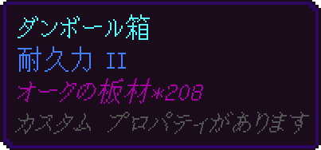
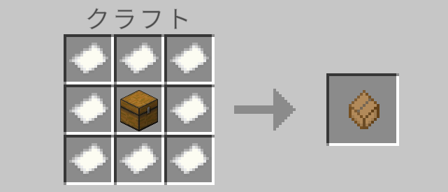

# Compactblocks Addon

## 概要

このアドオンは「段ボール箱」というアイテムを1つ追加します。1スロットに一種類のブロックをほぼ無限に入れられます。

## アイテム

### 段ボール箱

中にブロックが入った状態で右クリックで通常ブロックと同じように設置できます。

#### 使い方

##### 登録

空の状態で使用(右クリック)すると、選択モードになります。

選択モードの時にブロックを持って使用(右クリック)で段ボールの中にブロックをしまうことができます。

**ブロック以外を選択することはできません。**

> [!Warning]
> オフハンドにアイテムを持った状態では選択モードにできません。必ずオフハンドを空にした状態で使用して下さい。

##### 収納

中身入りの段ボール箱を持って何もない所に向かって右クリックをすることで、インベントリ内にある登録された種類のアイテムを全て収納できます。

また、同じアイテムを拾った時に自動で段ボールの中に入ります。

##### 設置
ブロックと同じように地面に向かって使用して中身を使用して設置ができます。擬似的な再現の為、少しクセがあったり **ジャンプブリッジができなかったり** します。

##### 取り出し

「しゃがみ+真下を向く+攻撃ボタン(殴る)」で収納されたアイテムを全ての取り出すことができます。インベントリから溢れた場合はその場にドロップする為、溶岩の近くでは使用しないで下さい。

##### 中身の確認

中身が入った段ボールはエンチャントと同様の紫色に光るエフェクトがつきます。

この状態の段ボールは、アイテムアイコンにカーソルを合わせた時、「アイテム名 * 個数」の形式で中身を確認できます。

 

#### レシピ

- 中央にチェスト(チェスト × 1)
- 紙で囲む(紙 × 8)

## 対応言語

- 日本語
- 英語(機械翻訳)

※ 英語は機械翻訳を利用している為、翻訳ミスが含まれている可能性があります。
